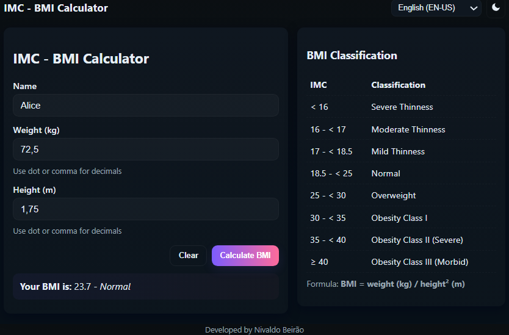

# Creating a BMI Calculator with Flutter

Project developed at Santander Bootcamp 2023 - Mobile with Flutter, under the guidance of specialist [Danilo Perez](https://github.com/perez-danilo "Danilo Perez").

In this challenge, you will create a simple calculator to calculate a person's BMI (Body Mass Index) using the **Dart** and **Flutter** programming languages.

**Challenge Checklist**:

- Create a Person class (Name / Weight / Height)
- Read data from the terminal
- Handle exceptions
- Calculate BMI
- Print the calculation result on the screen
- Tests

## Features

- **Dark-first** UI with a light mode toggle (moon / sun icons).
- **Multilingual**: English (EN-US), Portuguese (PT-BR), Spanish (ES).
- **Accessible**: semantic HTML, labels, `aria-live` for results, keyboard support.
- **Responsive**: works on desktop, tablet and smartphone.
- **Client-side**: no backend required; theme and language preferences persist via `localStorage`.
- **Robust input handling**: accepts dot or comma decimals, validates input and shows friendly error messages.

## Tecnologies used

- **Dart/Flutter**: Core language and framework used for the mobile application.
- **HTML**: semantic markup and UI.
- **CSS**: theme variables, responsive layout, accessible styles.
- **JavaScript**: translations, theme & language persistence, BMI logic and validation.
- **AI (Assistive)**:AI-assisted input validation and contextual suggestions.

## How to run

1. Open `index.html` in your browser (double-click or use a local static server).
2. Enter **weight (kg)** and **height (m)**, then click **Calculate BMI**.
3. Use the language selector to switch languages; the UI updates instantly.
4. Toggle theme with the moon/sun button. Preferences are saved.

## Accessibility notes

- Results are announced via `aria-live="polite"`.
- Error messages use `role="alert"` for immediate screen reader notification.
- All interactive controls are keyboard-focusable and have visible focus styles.
- Form uses semantic labels and `novalidate` to allow custom validation and friendly messages.

## BMI classification used

- **&lt; 16*: Severe Thinness
- **1: &lt; 17*: Moderate Thinness
- **1: &lt; 18.5*: Mild Thinness
- **18.: &lt; 25*: Normal
- **2: &lt; 30*: Overweight
- **3: &lt; 35*: Obesity Class I
- **3: &lt; 40*: Obesity Class II (Severe)
- **≥ 40*: Obesity Class III (Morbid)

## Notes for developers

- The BMI logic is implemented in `script.js` with a small `Person` class and pure functions `calculateBMI` and `classifyBMI`.
- The UI accepts both `,` and `.` as decimal separators and sanitizes input.
- To extend languages, add a new key to the `translations` object and an `<option>` in the language `<select>`.

[LICENSE](./LICENSE)
